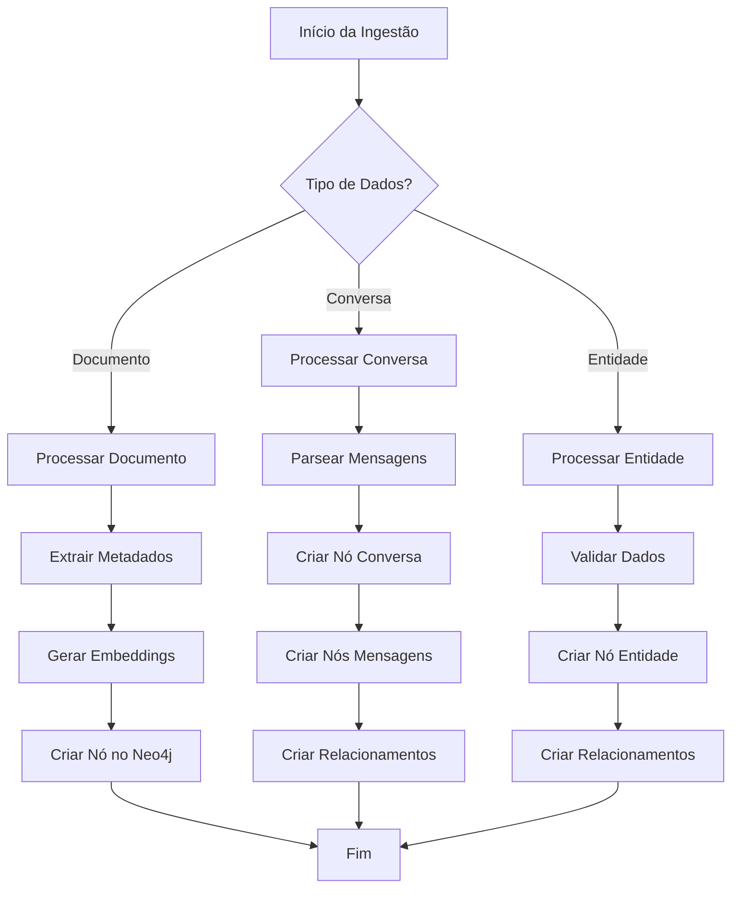

# Arquitetura e Fluxogramas do Sistema CoCreateAI

Este documento contém os fluxogramas e diagramas de arquitetura do sistema CoCreateAI usando Mermaid.

## 1. Arquitetura Geral do Sistema

## 2. Fluxo de Chat

## 3. Pipeline de Ingestão de Dados

## 4. Estrutura do Grafo Neo4j

## 5. Fluxo de Autenticação

## 6. Sistema de Menções (@)

## 7. Fluxo de Customização Visual

## Notas de Implementação

### Tecnologias Utilizadas
- **Frontend**: Next.js 15, React 19, TypeScript, TailwindCSS
- **Backend**: Python, Agno Framework, FastAPI
- **Database**: Neo4j (Aura)
- **LLM**: Azure OpenAI
- **Embeddings**: Azure OpenAI Embeddings

### Próximos Fluxos a Documentar
- [ ] Fluxo de gravação de áudio
- [ ] Fluxo de busca semântica
- [ ] Fluxo de RAG (Retrieval Augmented Generation)
- [ ] Fluxo de multi-agentes
- [ ] Fluxo de memória corporativa (KB)

---

**Última atualização**: 2025-10-15
